# MyMediaLibrary
멀티미디어 업로드/감상 서비스

* [api 링크](./api%20spec.md)   
* 벤치마크
    * 프로파일링을 통한 개선
        * [문제 발견](./벤치마크/미디어%20정보%20조회/%23001%20스레드%20100개%20-%20스레드마다%20요청%20100개.md)
        * [개선 결과](./벤치마크/미디어%20정보%20조회/%23002%20스레드%20100개%20-%20스레드마다%20요청%20100개.md)
    * 인덱스를 통한 pagination 성능 개선 
       * [문제 발견](./벤치마크/미디어%20목록%20조회/%23001%20스레드%20100개%20-%20스레드마다%201000번%20요청.md)
       * [인덱스 추가로 개선](./벤치마크/미디어%20목록%20조회/%23002%20스레드%2010개%20-%20스레드마다%201000번%20요청%20-%20인덱스%20추가.md)
       * [where절 수정으로 추가적 개선](./벤치마크/미디어%20목록%20조회/%23003%20스레드%2010개%20-%20스레드마다%202000번%20요청%20-%20where절%20수정.md)


## ToC
* 주요 기능
    * [댓글 샤딩](#댓글-샤딩)
    * [조회수 Pagination에서 항목 누락 탐지](#조회수-pagination에서-누락-항목-탐지)
    * [조회수 내림차순 Pagination 부하 감소](#조회수-pagination)
* [기능별 연관 소스파일](#기능별-연관-소스-파일)
    


### 댓글 샤딩


#### 개요
- 게시글의 댓글 샤딩
- 게시글 id에 나머지 연산 취한 값을 key로 사용
- 유저 테이블과 댓글 테이블이 물리적으로 분리
- 기존에 댓글 테이블과 유저 테이블을 join하던 것을 대체할 방안이 필요
- 후보
    1. 댓글 테이블에 유저 닉네임 컬럼 추가
    2. 각 샤드로 유저 테이블 복제
    3. 댓글 페이지 조회할 때마다 유저 닉네임 쿼리
- 1번 방식을 선택
- 구현
    - 유저 닉네임 변경
        1. 닉네임 변경 로그 생성
        2. 닉네임 변경
    - 로그 재생
        1. 별도 프로세스가 로그를 읽음
        2. 샤드의 닉네임 컬럼 업데이트
    - 댓글 작성
        1. 유저 닉네임 조회
        2. 유저 닉네임을 포함한 댓글 삽입
    - 댓글 조회
        1. 평범한 페이지 쿼리
- 세부적 고민 사항
    - atomic하게 로그 생성
        - primary key로 auto increment 사용 불가능
        - auto increment 값이 작다 != 트랜잭션 커밋이 먼저 되었다
        - 로그 누락될 수 있음
        - 따라서 유저 닉네임 변경/로그 생성 트랜잭션은 동시에 오직 하나만 실행돼야 함
    - 로그 생성 성능 높이기
        - 로그 큐를 여러개 만들어 순서가 상관 없는 로그들을 병렬적으로 처리
    - 샤드 추가/제거 시
        - primary key 충돌 문제
            - (게시글 id, 댓글 id)를 묶어 primary key로 사용
        - 재분배 이후 샤드의 큐 오프셋 문제
            - 재분배에 참여한 샤드들의 오프셋 중 가장 작은 것으로 통일
    - 로그 재생이 너무 뒤처진 경우의 처리
        - 유저 테이블을 통째로 읽어와 샤드 최신화
    - 샤딩때문에 기존 url이 깨지는 것에 대응
        - 최초 샤딩 이전에 댓글 id -> 게시글 id 매핑 테이블 생성
    - 댓글 작성
        - 댓글 삽입 후 유저 닉네임을 다시 검사해야 함
- 2번 방식을 선택하지 않은 이유
    - 유저 생성/삭제 로그도 남겨야 함
- 3번 방식을 선택하지 않은 이유
    - 필요한 쿼리 수가 많음

#### 상세
사용자가 게시판에 생성하는 댓글은 굉장히 많기 때문에 댓글 테이블을 샤딩해보고 싶었습니다. 게시판의 전체 댓글을 정렬한다거나 하는 일은 없기 때문에 게시글의 id를 기준으로 샤딩하면 될 것이라 생각했습니다. 하지만 댓글 조회시 댓글과 작성자 닉네임을 같이 응답으로 보내기 위해 댓글 테이블과 유저 테이블을 join했는데 댓글을 샤딩하면 join이 불가능해지는 문제가 있었습니다. 샤딩을 하면서도 댓글 조회 시 댓글과 작성자 닉네임을 같이 보내기 위해 생각해낸 방법 3가지 중 하나를 구현했습니다. 

1. 실제로 구현된 방식입니다. 기본적인 아이디어는 댓글이 작성될 때 <b>댓글에 유저 닉네임도 같이 저장</b>하는 것입니다. 이렇게 하면 유저가 닉네임을 변경했을 때 이 변경을 각 샤드에 반영해줘야 합니다. 데이터베이스에 장애가 발생해도 복구 후에 닉네임 변경이 샤드에 반영될 수 있도록 하기 위해 닉네임 변경 트랜잭션 내에서 로그를 남깁니다. 이 로그는 별도의 유틸리티 프로세스가 주기적으로 읽어서 샤드에 로그 내용을 반영합니다.

    * 샤딩 이전 테이블
        * 메인DB
            * User
                * id
                * nickname
                * ...
            * Comment
                * id
                * writerId
                * content
                * ...
    * 샤딩 이후 테이블
        * 메인DB
            * User
                * id
                * nickname
                * previousNicknameUpdate
                * ...
            * NicknameLogQueue
                * id
                * offset
            * NicknameLog
                * queueId
                * id
                * userId
                * newNickname
        * 샤드
            * Comment
                * id
                * writerId
                * <b>writerNickname</b>
                * confirmed
                * content
                * ...
            * NicknameLogQueue
                * id
                * offset

    특징
    * 유저 닉네임 변경에 대한 로그만 필요합니다.
    * 댓글 조회가 하나의 쿼리로 join없이 가능합니다.
    * 닉네임 변경 비용이 증가합니다.
    * 댓글 생성에 필요한 쿼리 수가 다른 방식보다 많습니다.

    구현에 앞서 문제가 생길 여지는 없는지 면밀히 검토해봤고 몇가지 주의할 점이 있었습니다.

    1. <b>로그의 id로 serial(auto increment)를 사용하면 일부 로그가 샤드에 반영되지 못할 수도 있습니다.</b>

        두 닉네임 변경 트랜잭션 A, B가 동시에 실행될 때 A에서 로그를 B보다 먼저 insert했지만 트랜잭션의 커밋은 B가 더 빠른 상황이 문제가 됩니다. 이 경우 A가 생성하는 로그의 id가 B가 생성한 로그의 id보다 더 작습니다. B가 커밋하고 아직 A가 커밋하지 않은 상황에서 유틸리티 프로세스가 로그를 읽어 가고 B의 로그id를 사용하여 샤드가 로그를 어디까지 반영했는지를 기록합니다. 이러면 샤드는 앞으로 B의 로그id보다 더 큰 로그만 반영할 수 있게 되고 A의 로그는 영영 반영되지 못합니다. 따라서 직접 serial을 구현했고 이를 위한 테이블이 NicknameLogQueue입니다. offset은 다음 로그에 사용할 id값이고 로그가 하나 생성될 때마다 1씩 증가합니다. row level lock을 걸기 때문에 NicknameLogQueue의 같은 로우의 offset을 증가시키려는 닉네임 변경 트랜잭션은 동시에 하나만 실행됩니다. 이로 인해 닉네임 변경 요청 처리량이 제한되는 것은 NicknameLogQueue에 로우를 추가하여 서로 다른 유저의 닉네임 변경 로그처럼 순서가 상관 없는 로그를 동시에 생성하고자 할 때 이용하면 됩니다. 
    
        메인DB와 샤드 간의 NicknameLogQueue 테이블을 비교하여 샤드가 반영해야 할 로그가 있는지 여부를 판단합니다.

    2. 댓글 생성 직후에 유저 닉네임을 다시 검사해야 합니다.
        
        댓글 생성 과정은 다음과 같습니다.
        1. 메인DB에서 유저 닉네임 쿼리
        2. 읽어온 닉네임과 함께 샤드에 댓글 생성

        메인DB에서 닉네임 변경 트랜잭션이 커밋되는 시점(A)와 유틸리티 프로세스가 샤드에 로그를 반영하는 트랜잭션이 시작하는 시점(B)에 따라서 문제가 생깁니다. 바로 1번 쿼리 - A - B - 2번 쿼리 순서로 실행되는 경우입니다. 1번 쿼리에서는 변경되기 이전의 닉네임을 읽어옵니다. B 시점이 지나고 나면 샤드의 댓글들이 A에서 변경된 닉네임이 반영된 상태일 것입니다. 하지만 B 이후 실행된 2번 쿼리의 댓글에는 변경 이전의 닉네임이 담겨있습니다. 이 댓글은 유저가 다시 닉네임을 바꾸기 전까지는 최신 닉네임과는 다른 닉네임을 가지게 될 것입니다. 이를 해결하기 위해 댓글 생성 시 다음 절차가 추가로 필요합니다.

        3. 다시 메인DB에서 유저 닉네임 쿼리
        4. 1번 쿼리에서 읽었던 닉네임과 3번의 결과가 다르다면 2번에서 생성한 댓글의 닉네임을 업데이트하고 confirm을 true로 업데이트하며, 같다면 confirm만 true로 업데이트

        이로써 위의 문제 시나로오의 경우 1 - A - B - 2 - 3 - 4 순서로 쿼리가 실행되어 최종적으로 샤드의 모든 댓글이 최신의 닉네임을 저장하게 됩니다. confirm은 3번과 4번 쿼리가 장애로 인해 미처 실행되지 못한 경우를 알아차리기 위한 컬럼입니다.

        3번과 4번 절차가 추가됨에 따라 새로운 문제가 생기지 않는다는 것을 1, 2, 3, 4, A, B의 배치에 따라 만들어지는 1234AB부터 AB1234까지의 15가지 경우의 수를 모두 검토하여 확인했습니다.

        다만 이 방법이 가능한 것은 유저의 닉네임 변경 간격을 최소 하루 이상으로 제한할 계획이기 때문에 가능했고 만약 이런 제한이 없다면 이 방법은 사용하기 어렵습니다.
2. 채택하지 않은 방법 중 하나는 <b>유저 테이블</b>의 일부 컬럼만 각 <b>샤드로 복제</b>하는 방식입니다. 1번 방식처럼 로그를 남기고 샤드에 로그를 반영하지만 닉네임 변경 로그 뿐만 아니라 유저 생성, 삭제 로그도 필요합니다. 샤드에서 댓글 쿼리를 할 때에는 샤드 내 유저 테이블과 join을 합니다. 1번 방식처럼 닉네임 변경 기간에 제한을 둘 필요가 없습니다. 또한 댓글 생성 시 닉네임을 다시 검사하는 일도 필요가 없습니다.
3. 채택하지 않은 마지막 방법은 새로운 테이블의 추가나 기존 테이블 변경이 없는 방식입니다. 샤드에서 댓글 쿼리 후 작성자id를 통해 각 댓글마다 개별적으로 유저의 닉네임을 쿼리합니다. 제일 간단하지만  응답으로 보낼 댓글 수만큼의 닉네임 쿼리가 발생하기 때문에 채택하지 않았습니다.

### 조회수 Pagination에서 누락 항목 탐지

#### SQL 쿼리
```sql
select *
from 
    "Media" 
    left outer join 
    "MediaPaginationSessionItem" 
    on 
        "Media"."id" = "MediaPaginationSessionItem"."mediaId" 
        and 
        "MediaPaginationSessionItem"."sessionId" = ${sessionId} 
where 
    ("Media"."viewCount", "Media"."uuid") > (${lowerViewCount}, ${lowerUuid}) 
    and 
    "MediaPaginationSessionItems"."sessionId" is null 
order by "viewCount" desc, "uuid" desc 
limit 10
```
#### 상세
조회수는 수시로 업데이트되므로 pagination에서 누락되는 항목이 발생할 수 있습니다.
테이블이 다음과 같을 때,

    id      view    ...
    1       100
    2       99
    3       98
    4       97
    5       96

A 사용자가 조회수 내림차순으로 길이 2의 페이지를 요청하면 1번 미디어, 2번 미디어의 
정보와 함께 다음 요청에 사용할 커서값으로 (3, 98)을 응답으로 전달합니다.

바로 이어서 조회수가 업데이트되어 테이블이 다음과 같이 되고

    id      view    ...
    4       200
    5       199
    1       100
    2       99
    3       98

이 다음 A 사용자가 이전 요청에서 받은 커서값과 함께 요청을 보내면 3번 미디어의 
정보와 이것이 페이지의 끝이라는 응답을 받게 될 것입니다. 4번과 5번이 누락된 것인데
이러한 사실을 사용자에게 알려줄 필요가 있다고 생각했습니다.

이를 위해서는 현재 사용자가 어떤 미디어의 정보를 받았는지에 대한 정보가 
필요했습니다. 이를 위해 MediaPaginationSession 테이블과
MediaPaginationSessionItem 테이블을 만들고 조회수 내림차순 페이지네이션 처리 
과정을 다음처럼 변경했습니다.

1. 사용자 요청에 세션 id가 없으면 세션 생성
2. 사용자 요청에 있는 조회수보다 큰 미디어의 id 집합에서 사용자 세션에 있는 
미디어 id 집합을 뺀 결과 남는 id가 있는지 확인
2. 사용자 요청대로 페이지 쿼리
3. 쿼리된 페이지에 포함된 미디어의 id들과 2번 과정에서 나온 id들을 사용자 
세션에 추가
4. 페이지 정보와 함께 2번 과정에서 나온 미디어의 정보, 세션id도 같이 응답으로
보냄

처음 데이터베이스 상태가 다음과 같을 때
    
    Media                     Session              SessionItem
    id      view    ...       id      ...          id      mediaId
    1       100               
    2       99
    3       98
    4       97
    5       96
    
A 사용자가 조회수 내림차순으로 길이 2의 페이지를 요청합니다. 요청에는 세션 정보가 
없으므로 새 세션을 생성하고 응답으로 보낼 1번, 2번 미디어를 생성된 세션에 
추가합니다. 응답에는 커서값 (3, 98)이 포함됩니다.
    
    Media                     Session              SessionItem
    id      view    ...       id      ...          id      mediaId
    1       100               1                    1       1
    2       99                                     1       2
    3       98
    4       97
    5       96
    
    4번, 5번 미디어의 조회수가 급증했습니다.
    
    Media                     Session              SessionItem
    id      view    ...       id      ...          id      mediaId
    4       200               1                    1       1
    5       199                                    1       2
    1       100               
    2       99                
    3       98
    
A 사용자가 세션 아이디 1과 커서 (3, 98)을 포함한 페이네이션 요청을 보냅니다.
서버는 미디어 중에서 view가 98보다 크거나, view가 98과 같고 id가 3보다 큰  미디어
집합 {4, 5, 1, 2}에서 세션 id가 1인 미디어 집합 {1, 2}를 뺍니다. 그 결과 4, 5가 
검출이 되고 이를 응답에 포함시켜 사용자는 누락되었을지도 모르는 항목을 알아차릴 수 
있게 됩니다.

이렇게 해결했지만 추가적인 고려사항이 있었습니다.
세션에 중복된 미디어 id를 넣는 경우인데 이 경우는 사용자가 보낸 이전 요청과 다음 
요청 사이의 시간보다 데이터의 쓰기 서버/읽기 서버 사이의 동기화 시간이 더 길 경우,
사용자가 이미 조회한 페이지를 다시 요청하는 경우에 발생합니다.
이는 MediaPaginationSessionItem의 primary key를 적절히 설정함으로써 
해결했습니다.

### 조회수 Pagination
#### 개요

#### 상세
조회수 내림차순으로 미디어를 조회하는 기능을 넣고 싶었지만 이를 위해서는 조회수 
컬럼에 인덱스를 설정해야 했습니다. 하지만 조회수는 업데이트가 빈번하므로 인덱스를 
섣불리 설정하기가 난감했습니다.

따라서 Media 테이블의 조회수 컬럼에 인덱스를 설정하되 Media 테이블과 1:1 관계인 
MediaViewCount 테이블을 만들었습니다. 실제 조회수 업데이트는 MediaViewCount 
테이블에서 수행하고 이 테이블의 조회수 컬럼으로 주기적으로 Media 테이블의 조회수 
컬럼에 업데이트하기로 했습니다.

Media 테이블에 새 컬럼을 추가한 대신 별도의 테이블을 만든 것은 다음 우려사항 
때문입니다.

PostgreSQL에서는 로우를 업데이트 할 때 기존 로우를 변경하는 것이 아니라, 
기존 로우에는 간단한 표시만 하고 남겨둔 채 업데이트된 버전의 로우를 새로 
추가합니다. 오래된 버전의 로우는 완전히 필요가 없어지게 되고 나면 주기적으로 
정리되지만 이 속도가 업데이트 속도보다 느리면 테이블의 물리적 크기가 커져 
다른 쿼리 성능에 영향을 줄 수 있습니다. 분리된 테이블의 업데이트는 Media 
테이블에 영향을 주지 않으므로 이런 문제에 영향을 받지 않습니다.

<br>


## 기능별 연관 소스 파일
### 프로그램 엔트리
main.js

<br>

### 라우터
usersRouter.js<br>

    계정 등록, 정보 수정, 구독, 북마크, 컨텐츠 업로드,
    업로드한 컨텐츠 / 작성한 댓글 / 북마크 / 구독 목록 조회

mediaRouter.js<br>

    댓글 작성, 태그 검색, 정렬, 댓글 목록 조회,
    컨텐츠 다운로드

authRouter.js

    로그인 / JWT 발행

<br>

### 데이터베이스
model.js<br>
commentShardModel.js

    Sequelize ORM 모델 정의

repository/converter.js<br>

    Sequelize 함수의 반환 형식을 repository 레이어의 형식으로 변환
    하는 함수들 정의

repository/bookmarkRepository.js<br>
repository/commentRepository.js<br>
repository/followingListRepository.js<br>
repository/mediaListRepository.js<br>
repository/mediaRepository.js<br>
repository/userRepository.js

    쿼리 수행

<br>

### 페이지네이션
pagination.js

    커서 기반 페이지네이션을 수행하는 Pagination 클래스 정의

<br>

### 유효성 검증
checker.js

    uuid, cursor, tagList 등 클라이언트가 보낸 값들이 서버에서
    지정한 형식과 조건을 따르는지 검사하는 함수들 정의

<br>

### 보안, 인증
authorizer.js<br>
    
    클라이언트의 요청을 승인하기 위한 Authorizer 클래스 정의

digest.js<br>

    패스워드로부터 해시값 생성

securityService.js

    보안 관련 함수에 사용되는 파라미터 값들 설정

<br>

### 프로그램 설정
serverConfig.js

    포트, 비밀키 파일 경로, sequelize 인스턴스 등 전역 변수 설정

<br>

### 예외 처리
error.js<br>

    HTTP 상태코드, 에러 메시지를 묶은 예외 클래스 정의

errorHandler.js

    예외 로깅, 클라이언트에게 적절한 응답 보내는 함수 정의

<br>

### AWS S3
storageService.js

    AWS S3를 이용하기 위한 객체 생성

### 유틸리티
utility/main.js
