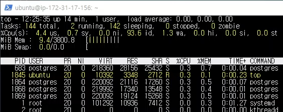
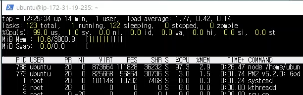
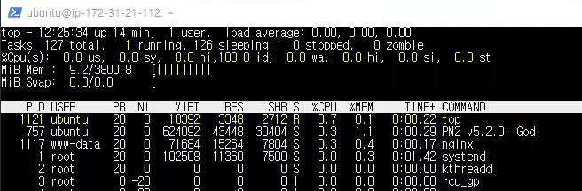
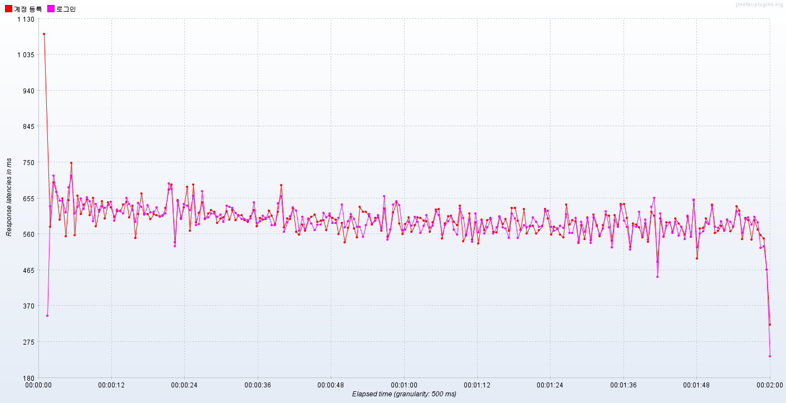

# 개요
    계정을 등록하고 해당 계정으로 로그인하기를 총 2000번 반복.
    최대 동시 연결 수: 20.

# 캡쳐 화면   
DB 서버   
   
Nodejs 서버   
   
Nginx 서버   
   
   
nodejs 서버의 cpu 이용률이 100%에 가깝다.   

# 응답 지연시간   
   
빨간색이 계정 등록, 분홍색이 로그인   
     
계정 등록   

    평균: 601 ms   
    하위 5%: 713 ms   
    최대: 1125 ms   

로그인   

    평균: 595 ms   
    하위 5%: 700 ms   
    최대: 983 ms   

# 초당 처리한 요청 수
    33.2개

# 클라이언트 패킷 수신 속도
    계정 등록: 3.57 KB/s
    로그인: 32.90 KB/s

# 분석
    비밀번호를 해시하기 때문에 nodejs 서버의 cpu에서 병목 현상이 나타났다.
    이에 반해 nginx 서버와 db 서버 둘 다 매우 여유로웠다.
    처리량을 늘리기 위해서는 nodejs 서버 인스턴스를 늘리는 수 밖에 없어 보인다.