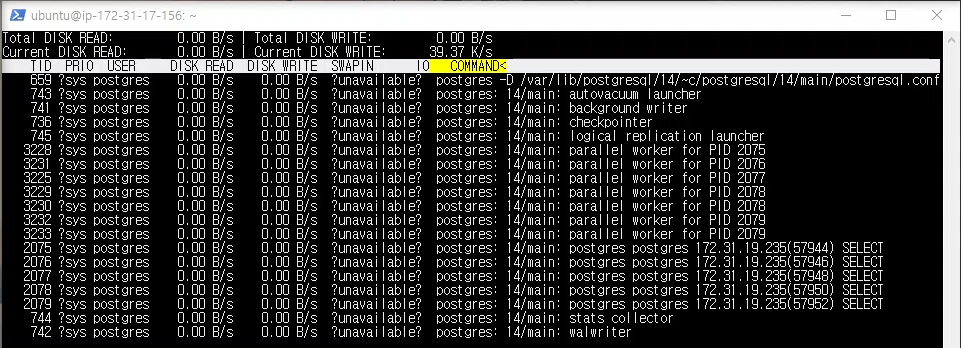

# 개요
    미디어 목록을 조회하는 요청을 10만개 보냈다.
    최대 동시 연결 수: 100개
    테스트 전에 등록된 미디어 수: 54만개
    
    시간이 너무 오래 걸려서 중단했다.
    
# 캡쳐 화면    
db 서버 cpu   
   
db 서버 ssd   
   
nginx 서버   
   
nodejs 서버   

db 서버 cpu 이용률이 100%이다.

# 응답 지연시간   
   
파란색은 연결시간, 빨간색은 응답 지연시간 그래프   

평균: 51886 ms   
하위 5%: 57933 ms   
최대: 60060 ms   

# 초당 처리한 요청 수
    1.9개

# 클라이언트 패킷 수신 속도
    22.78 KB/s

# 분석
    db 서버의 ssd 읽기 속도에서 병목이 일어날 것이라 예상했던 것과 달리 db 서버의 cpu에서 병목현상이 나타났다. 초당 처리량도 매우 낮고 응답 지연시간이 60초를 넘어 nginx로부터 504 응답을 받은 요청도 많았다. SQL 쿼리문은 다음과 같다.

    SELECT 
        *
    FROM 
            "Media"
        LEFT OUTER JOIN 
            "User"
        ON 
                "Media"."uploaderId" = "Uploader"."id" 
            AND 
                "Uploader"."deletedAt" IS NULL
    WHERE 
            "Media"."deletedAt" IS NULL 
        AND 
            (
                    "Media"."createdAt" < '9999-01-01 00:00:00.000 +00:00' 
                OR 
                    (
                            "Media"."createdAt" = '9999-01-01 00:00:00.000 +00:00'
                        AND 
                            "Media"."random" >= 0
                    )
            )
    ORDER BY "Media"."createdAt" DESC, "Media"."random" ASC 
    LIMIT 51;

    정렬이 원인이라고 예상하지만 확실하게 파악한 것은 아니다.
    원인이 무엇이든지 클라이언트에게 보낼 응답을 캐싱하여 
    db 서버에 쿼리를 보내는 횟수를 줄여야 한다는 것은 분명해 보였다.
    
    