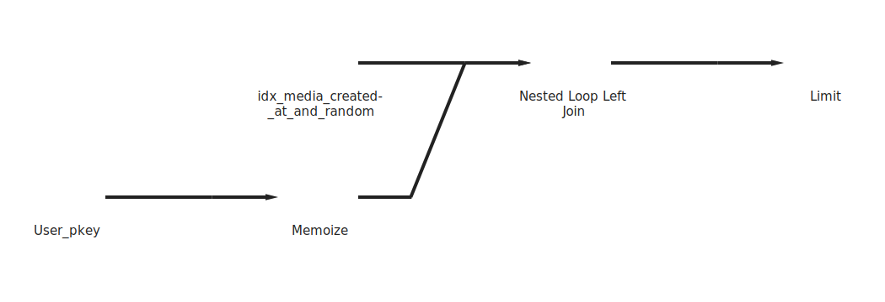
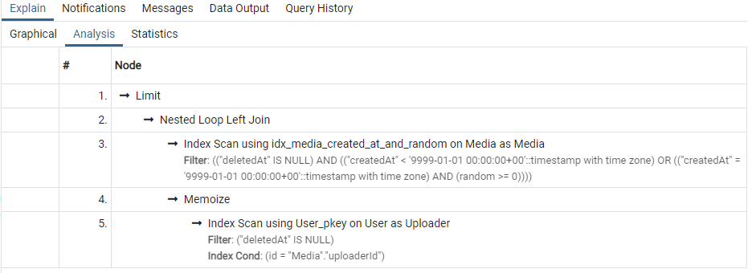
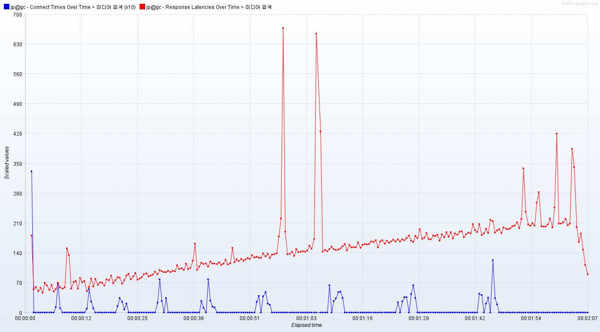

# 개요
    미디어 목록을 조회하는 요청을 10000개 보냈다.
    최대 동시 연결 수: 10개
    테스트 전에 등록된 미디어 수: 57만개
    
    "Media" 테이블의 "createdAt" 컬럼과 "random" 컬럼에 대한 복합인덱스를 추가했다.

    쿼리 실행 계획은 다음과 같다.
   
    

# 응답 지연시간   
   
파란색은 연결시간, 빨간색은 응답지연시간

평균: 124 ms   
하위 5%: 214 ms   
최대: 980 ms   

# 초당 처리한 요청 수
    78.7개

# 클라이언트 패킷 수신 속도
    1001.52 KB/s

# 분석
    인덱스를 활용해서 정렬이 필요 없어진 것을 확인할 수 있다.
    초당 처리량이 확연히 증가한 것을 볼 수 있다.
    