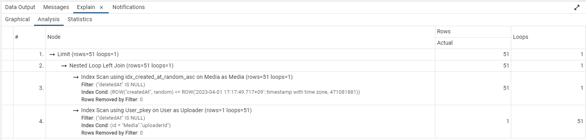
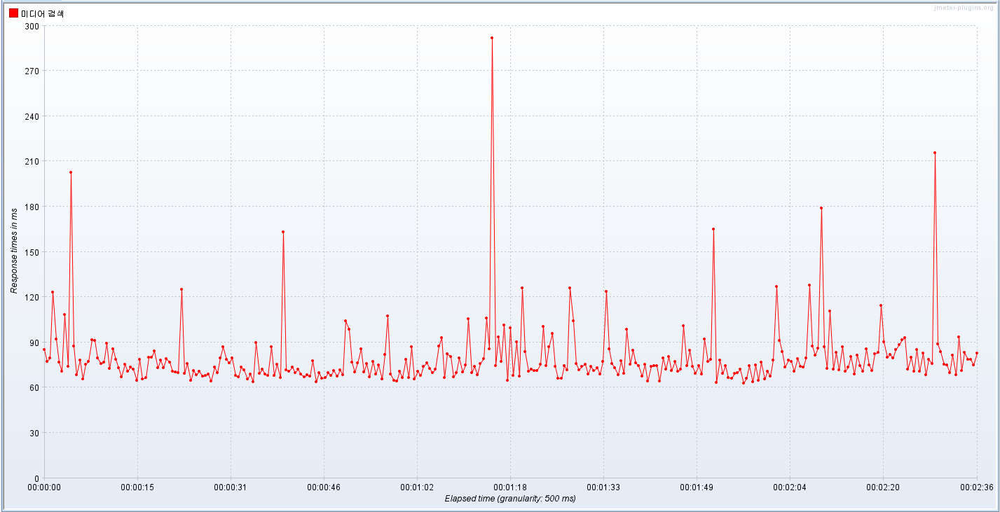

# 개요
    미디어 목록을 조회하는 요청을 20000개 보냈다.
    최대 동시 연결 수: 10개
    테스트 전에 등록된 미디어 수: 약 20만개

    #001, #002와는 테스트 환경이 다르지만 응답시간의 추세 변경만 확인하면 되므로
    문제되는 점은 없다.
    
    #002에서 응답 시간 그래프가 우상향하는데 어떤 페이지를 요청하든 인덱스 스캔이
    인덱스의 맨 앞에서 시작하는 것이 원인인 것으로 파악되었다.
    
    따라서 쿼리의 where절을 다음과 같은 형태에서
    "createdAt" < '2000-01-01T00:00' or 
    ("createdAt" = '2000-01-01T00:00' and "random" <= 1234)

    다음과 같이 변경해서 인덱스 스캔이 인덱스의 중간부터 시작할 수 있도록 했다.
    ("createdAt", "random") <= ('2000-01-01T00:00', 1234)

    변경된 쿼리 실행 계획은 다음과 같다.
   

    #002에서는 Filter에 있던 조건이 Index Cond로 옮겨간 것을 확인할 수 있다.

# 응답 지연시간   
   

    평균: 77 ms   
    하위 5%: 113 ms   
    최대: 462 ms 
    
# 분석
    #002에서는 점점 뒤쪽의 페이지를 요청할수록 응답시간이 길어진 것에 비해
    이번 테스트에서는 앞쪽이나 뒤쪽이나 비슷한 응답시간을 보여주는 것을 확인할 수 있다.
    따라서 바뀐 where절이 인덱스를 더 효율적으로 사용한다는 것을 알 수 있다.
