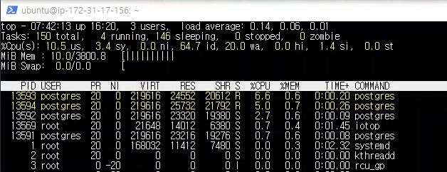
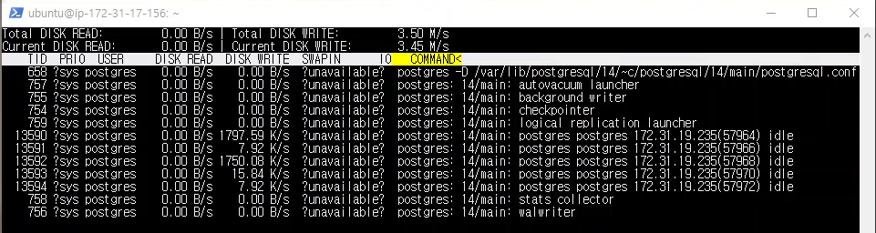
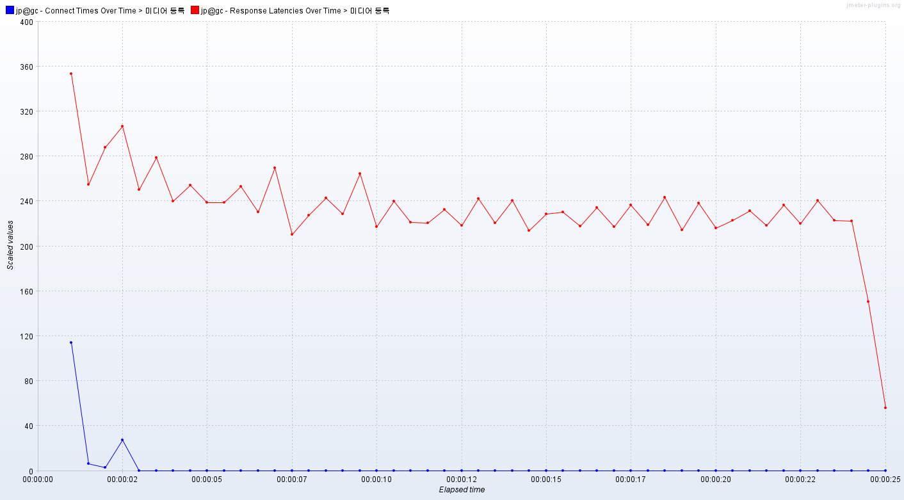

# 개요
    제목과 같은 미디어 정보 등록 요청 10000개를 보냈다.
    최대 동시 연결 수: 100개
    
    테스트 전에 미리 등록한 임시 계정 수: 약 6만개
    테스트 전에 미리 등록한 미디어 수: 약 4000개
    
# 캡쳐 화면   
db 서버 cpu   
       
db 서버 ssd   
       
nginx 서버   
       
nodejs 서버   
           
   
nodejs 서버의 cpu 이용률이 100%이다.

# 응답 지연 시간   
   
파란색은 연결 시간, 빨간색은 응답 지연시간   

평균: 234 ms   
하위 5%: 292 ms   
최대: 823 ms   

# 초당 처리한 요청 수
    403개

# 클라이언트 패킷 수신 속도
    736.40 KB/s

# 분석
    nginx 서버는 매우 여유롭고 db 서버도 cpu 이용률이 50%보다 낮은 모습을 보였다. 
    미디어 정보를 등록하는 요청은 JWT를 검증하기 때문에 nodejs 서버의 cpu에서
    병목현상이 나타난 것이라고 생각했다. 하지만 미디어 정보 조회 테스트를 통해 
    cpu에 부하가 걸린 것은 JWT 때문이 아니라 로깅때문이라는 것을 알게되어 
    수정 후에 같은 조건으로 다시 테스트했다.