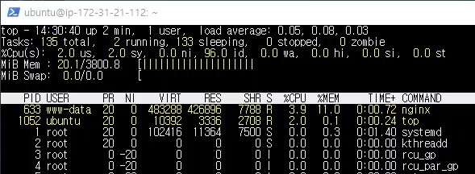

# 개요
    제목과 같은 미디어 정보 등록 요청 10000번 보냈다.
    최대 동시 연결 수: 100개.

    nodejs에서의 로깅 방식 수정 후 테스트했다.(미디어 정보 조회 테스트 참고)

# 캡쳐 화면   
db 서버 cpu   
   
db 서버 ssd   
   
nginx 서버   
   
nodejs 서버   
   

# 응답 지연시간   
   
파란색은 연결 시간, 빨간색은 응답 지연시간   

평균: 213 ms   
하위 5%: 330 ms   
최대: 1375 ms   

# 초당 처리한 요청 수
    457개

# 클라이언트 패킷 수신 속도
    832.24 KB/s

# 분석
    #001 테스트와 마찬가지로 nodejs에서 병목현상이 나타났지만 
    로깅으로 인해 cpu가 낭비되던 것을 해결하여 처리량이 증가했다.