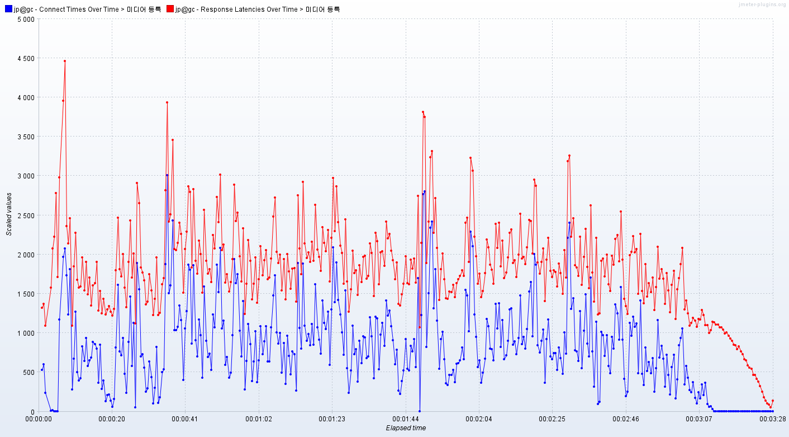

# 개요
    미디어 등록 요청 총 10만개를 보냈다.
    최대 동시 연결 수: 1000개.

    로깅 문제를 해결하기 이전에 수행된 테스트이다.

# 캡쳐 화면   
# 초당 처리한 요청 수
# 클라이언트 패킷 수신 속도
    이 테스트는 성능 측정이 중요하지 않아 첨부하지 않았다.

# 응답 지연시간
   
파란색은 연결시간, 빨간색은 응답 지연시간   

# 분석
    keepalive 헤더가 사용되었음에도 파란색 연결시간 그래프가 매우 들쭉날쭉하다. 
    또한 전체 요청 중 약 10% 정도가 nginx로부터 500 응답을 받았는데 이것이 
    원인이라고 생각했다. nginx의 로그를 확인하여 Too many open files라는 
    메시지를 확인했고 nginx 설정 파일과 모든 서버의 /etc/security/limits.conf 파일을 
    수정하여 프로세스당 파일 디스크립터의 개수를 충분히 늘리고 다시 테스트했다.