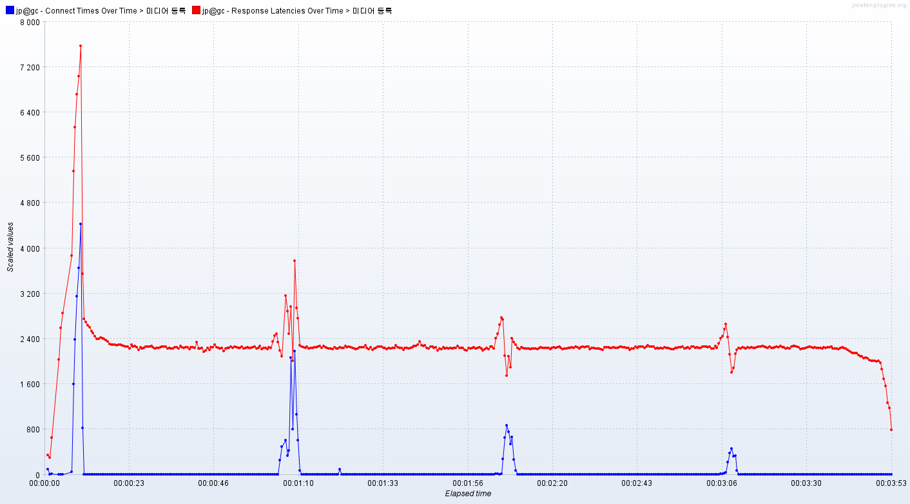

# 개요
    미디어 등록 요청 총 10만개를 보냈다.
    최대 동시 연결 수: 1000개.
    테스트 전에 등록된 미디어 수: 44만개

    로깅 문제를 해결하기 전에 수행된 테스트이다.

# 응답 지연시간
   
파란색은 연결시간, 빨간색은 응답 지연시간  

평균: 2284 ms   
하위 5%: 2497 ms   
최대: 21070 ms   

# 초당 처리한 요청 수
    428.5개

# 클라이언트 패킷 수신 속도
    782.67KB/s

# 분석
    파일 디스크립터 최대 개수 문제를 해결하니 500 응답은 하나도 오지 않았고 연결 시간 그래프가 안정된 모습을 보였다. 
    최대 연결 수가 100개일 때와 비교했을 때 요청 하나당 응답 지연시간은 10배로 증가했지만 초당 처리량은 크게 변하지 않은 것을 확인할 수 있다. 