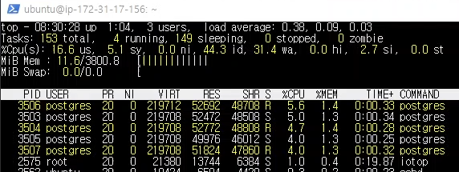
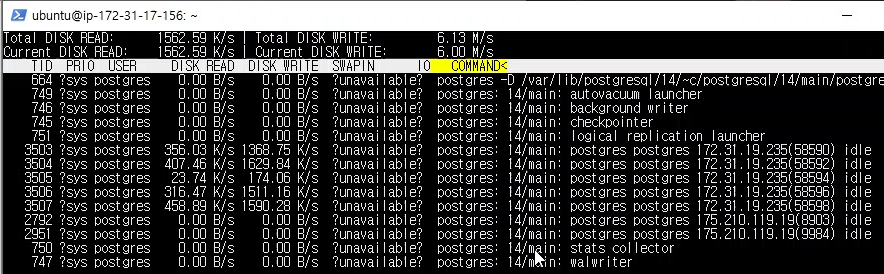
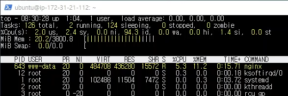
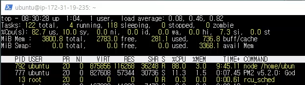
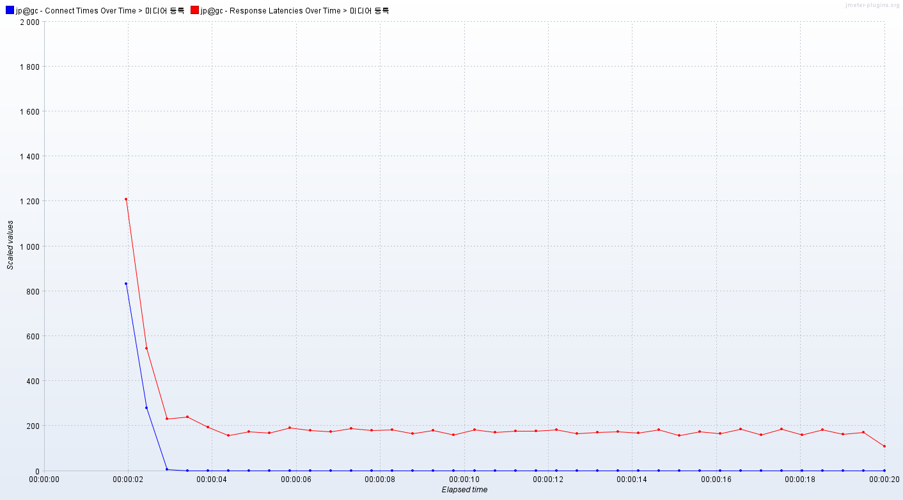

# 개요
    미디어 등록 요청 총 1만개를 보냈다.
    최대 동시 연결 수: 100개.
    테스트 전에 등록된 미디어 수: 57만개

    Media 테이블의 viewCount 컬럼과 random 컬럼에 대한
    인덱스를 생성한 뒤 테스트를 수행했다.   

# 캡쳐 화면   
db 서버 cpu   
   
db 서버 ssd   
   
nginx   
   
nodejs   
   

# 응답 지연시간
   
파란색은 연결시간, 빨간색은 응답 지연시간  

평균: 187 ms   
하위 5%: 250 ms   
최대: 1494 ms   

# 초당 처리한 요청 수
    506.9

# 클라이언트 패킷 수신 속도
    925.34 KB/s

# 분석
    #002 테스트와 비교했을 때 인덱스가 추가되었기 때문에 ssd에 쓰는
    데이터 양이 늘었다. 그러나 인덱스가 추가되었음에도 초당 처리한 
    요청 수가 증가했는데 네트워크 상태가 이전보다 원활해졌다거나 다른
    외부 요소가 작용한 것 같다.
    어쨌거나 인덱스를 추가한 것이 테이블에 데이터를 삽입하는 성능에
    큰 영향을 주지는 않는 것으로 보인다.