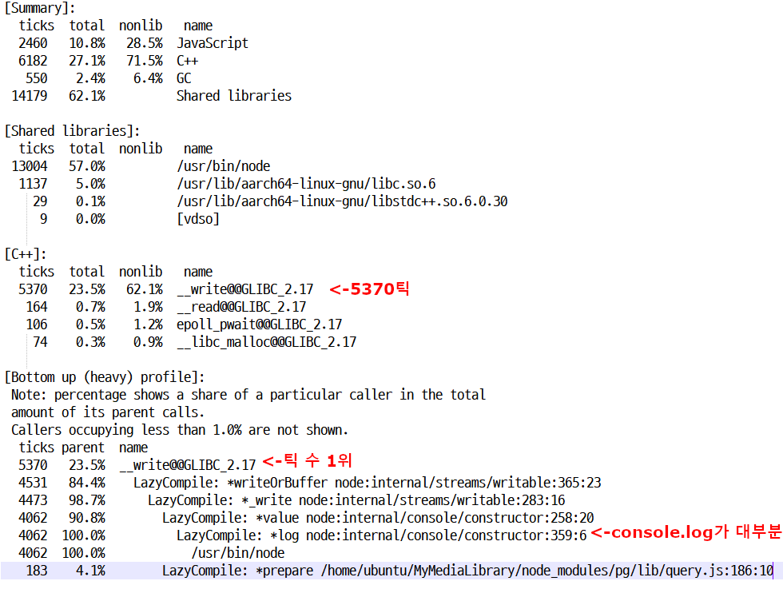

# 개요
    미디어의 상세 정보를 조회하는 요청을 10000개 보냈다.
    최대 동시 연결 수: 100개
    테스트 전에 등록되어 있던 미디어 개수: 54만개

# 캡쳐 화면  
db 서버 cpu   
   
db 서버 ssd   
   
nginx 서버   
   
nodejs 서버   

nodejs 서버의 cpu 이용률이 100%이다.

# 응답 지연시간   
   
파란색은 연결 시간, 빨간색은 응답지연시간

평균: 272 ms   
하위 5%: 394 ms   
최대: 1395 ms   

# 초당 처리한 요청 수
    361.8개

# 클라이언트 패킷 수신 속도
    190.43 KB/s

# 분석
    db 서버의 ssd가 병목이 될 것이라고 예상했지만 실제로는 nodejs 서버의 cpu가 병목이 되었다. 이번 테스트는 암호 관련 연산이 전혀 사용되지 않기 때문에 이 결과가 이해되지 않았다.
    따라서 nodejs에 내장된 프로파일러를 사용해서 cpu를 많이 사용하는 원인을 찾기로 했다.
    아래는 측정 결과의 일부이다.    
   

    또한 JWT 검증 때문에 cpu에서 병목이 발생한 것이라 생각했던 미디어 등록 테스트도 다시 테스트해서 프로파일링 결과를 확인해보니 위의 결과와 비슷했고 JWT 검증이 차지한 cpu 점유율은 매우 작았다.
    nodejs 바이너리를 제외하면 __write 함수가 틱 수가 가장 많았고 이 함수는 거의 console.log에 의해 호출된 것으로 보였다. sequelize에서 실행하는 쿼리문을 출력하도록 했고 프로그램의 다른 부분에서도 console.log를 사용한 것이 원인이라 생각했고 이 부분을 개선하기로 했다.
    db 서버의 ssd 이용률을 보면 읽는 양보다 쓰는 양이 더 많은데 이것도 의외였다.
    