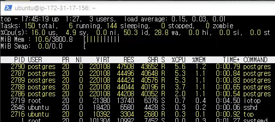
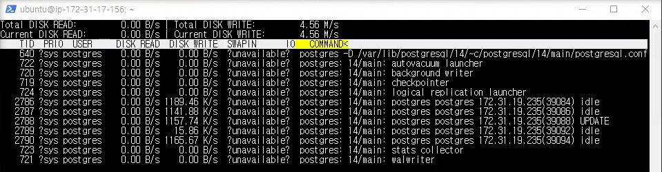
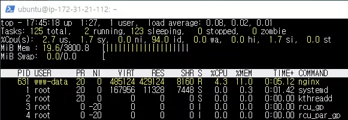
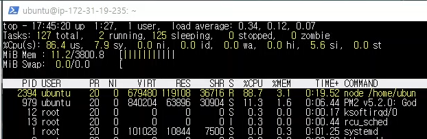
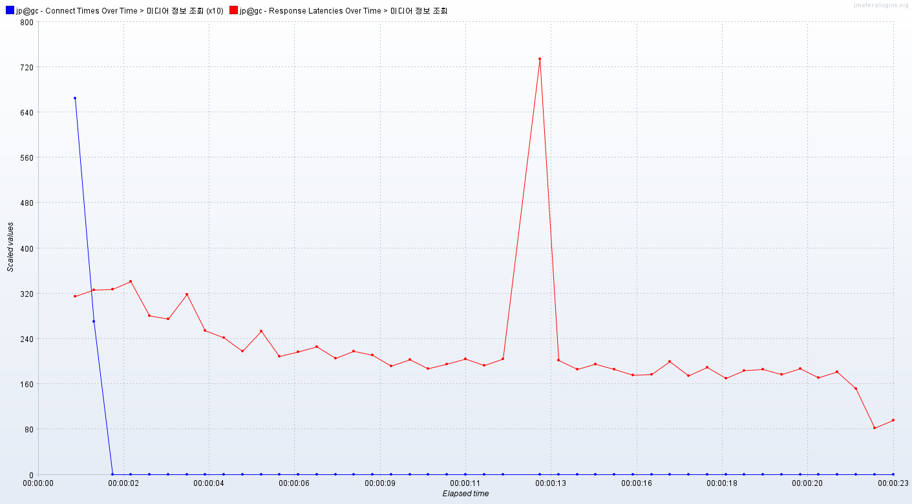
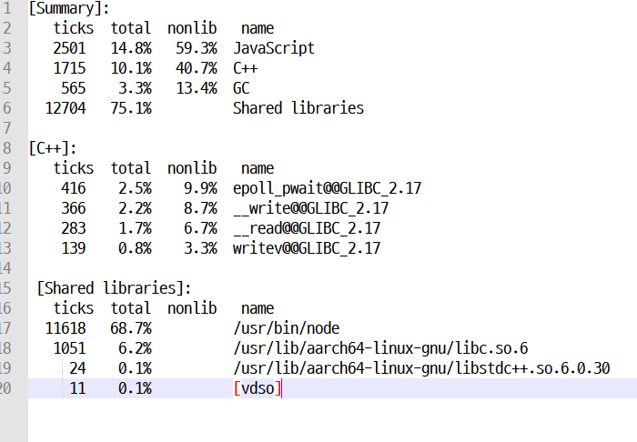

# 개요
    sequelize는 쿼리문을 출력하지 않도록 했고 예외가 발생했을 때 로그를 남기는 것은 winston 라이브러리를 사용하여 파일에 저장하도록 했다.

# 캡쳐 화면  
db 서버 cpu   
   
db 서버 ssd   
   
nginx 서버   
   
nodejs 서버   
   

nodejs 서버 cpu 이용률이 100%이다.

# 응답 지연시간   
   
파란색은 연결시간, 빨간색은 응답 지연시간

평균: 214 ms   
하위 5%: 312 ms    
최대: 1214 ms   

# 초당 처리한 요청 수
    442.9개

# 클라이언트 패킷 수신 속도
    233.13 KB/s

# 분석
    프로파일링 결과는 다음과 같다.
   

    __write 함수의 틱 수가 확연하게 줄어들었다. 따라서 이전 테스트에 비해 초당 처리량도 
    크게 증가한 것을 확인할 수 있다.
    