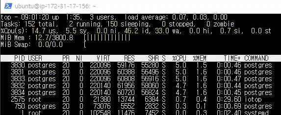
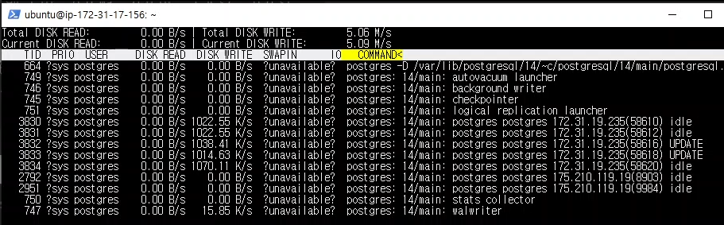
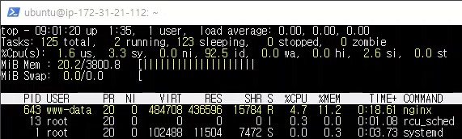
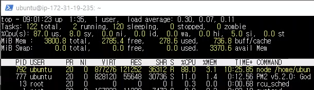
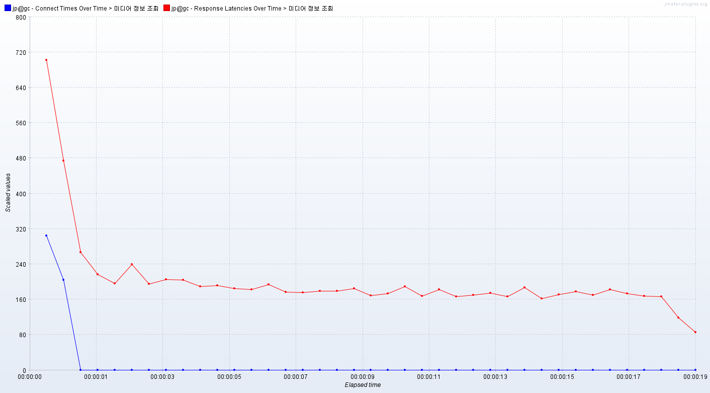

# 개요
    미디어의 상세 정보를 조회하는 요청을 10000개 보냈다.
    최대 동시 연결 수: 100개
    테스트 전에 등록되어 있던 미디어 개수: 58만개

    Media 테이블의 viewCount 컬럼과 random 컬럼에 대한 인덱스를 추가한 뒤
    테스트했다.

# 캡쳐 화면  
db 서버 cpu   
   
db 서버 ssd   
   
nginx 서버   
   
nodejs 서버   
   

# 응답 지연시간   
   
파란색은 연결시간, 빨간색은 응답 지연시간

평균: 188 ms   
하위 5%: 260 ms    
최대: 1173 ms   

# 초당 처리한 요청 수
    511.4 개

# 클라이언트 패킷 수신 속도
    269.67 KB/s

# 분석
    #002 테스트와 비교했을 때 인덱스가 추가되었기 때문에 ssd에 쓰는
    데이터 양이 늘었다. 그러나 인덱스가 추가되었음에도 초당 처리한 
    요청 수가 증가했는데 네트워크 상태가 이전보다 원활해졌다거나 다른
    외부 요소가 작용한 것 같다.
    어쨌거나 인덱스를 추가한 것이 조회수를 업데이트 하는 성능에 크게 영향을
    주지는 않는 것으로 보인다.
    